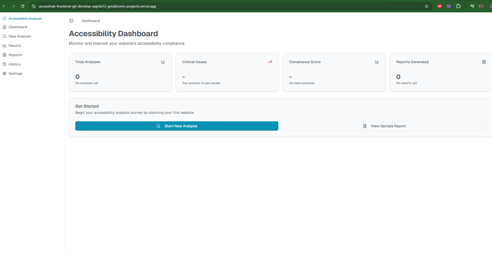

# AccessiHub Frontend

AccessiHub Frontend is a **Next.js web application** that lets users analyze website accessibility.  
It connects with the [AccessiHub Backend](https://github.com/vjolamuthyasai/accesshub-backend) to fetch accessibility reports, display issues in a structured dashboard, and generate downloadable reports (PDF/JSON/CSV).

---

## 🚀 Features

- Input a website URL for accessibility testing.
- Trigger accessibility scans via backend API.
- View issues in a clean, dashboard-style interface.
- Download results in multiple formats (PDF, JSON, CSV).
- Built with **Next.js + TailwindCSS** for speed and responsiveness.
- Deployed on **Vercel** with automatic CI/CD.

---

## 🛠️ Tech Stack

- **Frontend:** [Next.js](https://nextjs.org/), React, TailwindCSS
- **Deployment:** [Vercel](https://vercel.com)
- **Backend API:** [AccessiHub Backend](https://github.com/vjolamuthyasai/accesshub-backend) (Flask)

---

## 📦 Getting Started

### Prerequisites

- Node.js **>=18.x**
- npm or yarn

### Installation

```bash
# Clone the repository
git clone https://github.com/your-org/accessihub-frontend.git
cd accessihub-frontend

# Install dependencies
npm install
# or
yarn install

npm run build

npm run start

# Access Hub

This is the home screen of the app:

```
